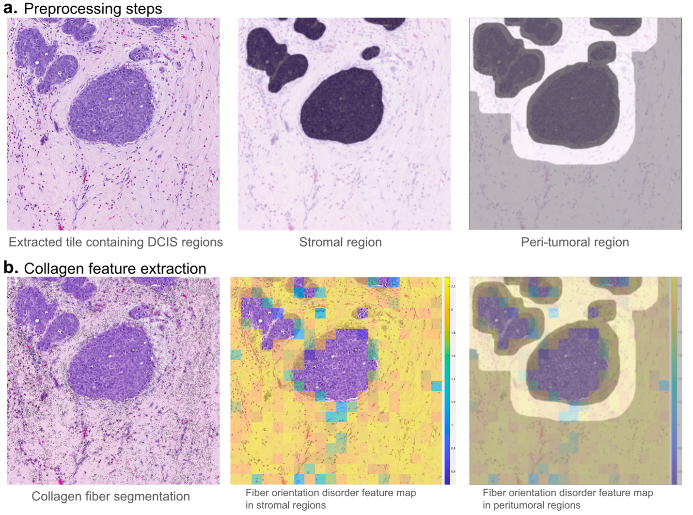

# Collagen-based Computational Pathology Predictive Biomarker for DCIS patients

---

## Authors
Arpit Aggarwal and Anant Madabhushi 

## Packages Required
Matlab and Python were used for this study. 
The packages required for running this code are PyTorch, Numpy, Openslide, PIL, OpenCV, Pandas, Sklearn, and Matplotlib. 

## Workflow for the study

## Pipeline for Collagen biomarker
The main steps involved in the Collagen biomarker are as follows:
1. Preprocessing steps (Stroma segmentation)
2. Extracting collagen features

## Running the code
1. <b>Preprocessing steps</b> 
    a. <b>Epithelium/Stroma segmentation</b> - To segment the epithelium/stromal regions on the patches extracted above, run the pretrained epithelium/stroma model 'python3 code/epithelium_stroma_segmentation.py'. The model weights file are located at 'code/epi_seg_unet.pth'.  
In the epithelium/stroma mask, the white regions correspond to the tumor/epithelium areas and the black regions correspond to the stromal areas. We will use the black regions for segmenting collagen fibers and the following code automatically handles it (255-epi_stroma_mask).

2. <b>Extracting collagen features</b> 
For extracting the collagen features run the file (code/main_patchLevelFeatures.py) that generates the Collagen Fiber Orientation Disorder map for each patch extracted. The feature maps will be stored over here 'results/patches'.
  
After obtaining the feature maps for each tile, run the file (code/main_patientLevelFeatures.py) that gives patient-level features (mean and maximum) for each patient, giving a total of 36 features. The features for each patient will be stored over here 'results/features' which can be used for downstream tasks like survival analysis etc.  

## Survival analysis
Using the extracted features, use the notebook 'code/collagen_signature_TAM.ipynb' for an example demo for running the survival analysis pipeline.

## License and Usage
Madabhushi Lab - This code is made available under Apache 2.0 with Commons Clause License and is available for non-commercial academic purposes.